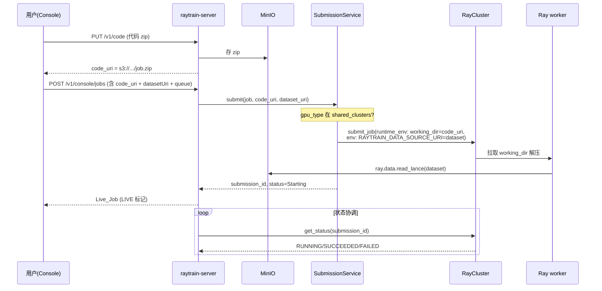
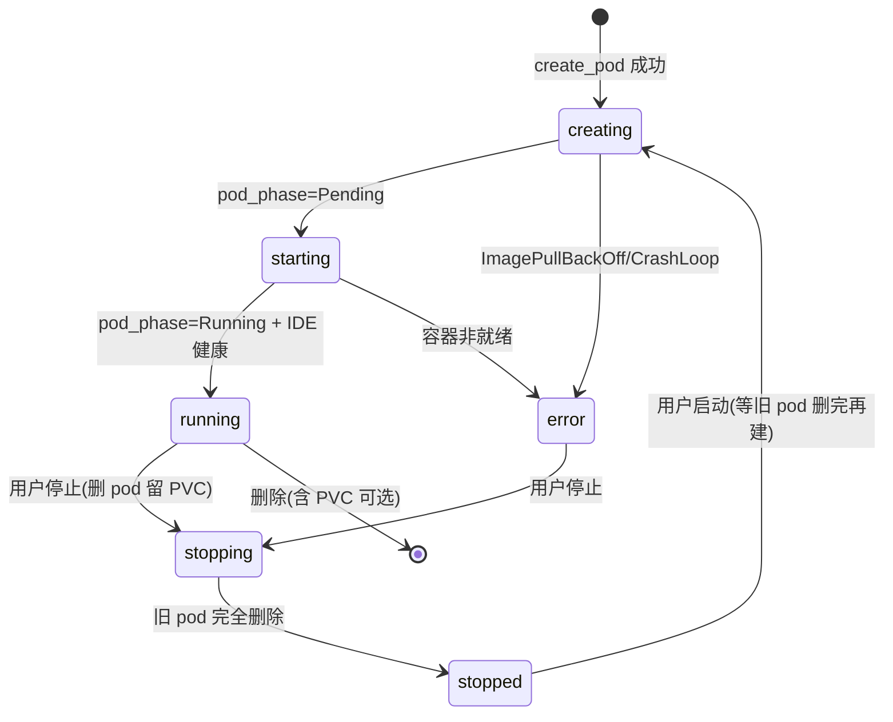

# Design Document

## Overview

本设计把 raytrain 平台从"看起来可用"推进到"真实、端到端、完整可交付"。它不引入新框架，
而是**沿用现有架构模式**，把当前用占位/合成数据或假状态的链路替换为真实集群接入：

- **可注入客户端**：现有 `RayClusterClient` / `K8sClient` / `SubmissionService` 都已是
  "构造时可注入、测试用 fake"的模式。本设计为新增的集群接入点（`KueueReader`、
  `LokiClient`、`PrometheusClient`、Workspace 状态映射）沿用同一模式。
- **双后端存储**：现有 users/workspaces/dev-sessions/datasets 已有 内存 + SQL 两套实现，
  由 `bootstrap.configure_persistence` 按 `RAYTRAIN_DATABASE_URL` 选择。本设计把 jobs/
  queues(自管元数据)/resources 接入同一机制。
- **控制面持唯一凭据**：用户永不接触 K8s，所有 Pod/Service/Ingress/Kueue/Loki/Prometheus
  访问都由 `raytrain-server` 用自己的 ServiceAccount 完成。
- **优雅降级 + 显式标注**：当某后端能力未配置（无集群、无域名、Loki/Prometheus 不可达），
  返回结构化 `FriendlyError`，前端显式提示"不可用"，**不再用合成数据伪装**。

设计覆盖 8 个范围域共 14 条需求。下面先给整体架构，再逐组件展开，最后给数据模型、错误
契约、i18n、部署接入、测试策略与按需求的可追溯映射。

### 设计原则（贯穿全文）

1. **真实优先，降级显式**：有真实数据源就用真实数据；没有就报 `FriendlyError` 并在 UI 标
   "不可用"，绝不回退到 seed/mock 充数（满足 Req 14）。
2. **集群接入皆可注入**：每个新客户端都有 Protocol/构造注入缝 + fake 实现，CI 无需真实集群
   即可回归（满足 Req 7/9/10）。
3. **状态来自集群真相**：Workspace/Job 的展示状态由 K8s/Ray 真实相位映射而来，不再由写入
   时一厢情愿地置位（满足 Req 1/5）。
4. **不破坏既有绿测**：所有改动保持现有 store/接口签名，新增能力以新方法/新模块加入。

---

## Architecture

### 组件全景

```mermaid
flowchart TB
    subgraph Browser[浏览器]
        Console[raytrain-console<br/>React + i18n zh/en]
    end

    subgraph Ingress[Access Layer]
        IG[Ingress Controller + TLS<br/>console / api / ws-IDE]
        SSHGW[SSH 网关 / NodePort]
    end

    subgraph Server[raytrain-server 控制面]
        API[/v1/* + /v1/console/*/]
        WS[WorkspaceService<br/>真实相位映射]
        SUB[SubmissionService<br/>真实 RayJob]
        KQ[KueueReader]
        LOKI[LokiClient]
        PROM[PrometheusClient]
        STORES[(Stores: 内存 / SQL)]
    end

    subgraph Cluster[K8s 集群已有设施]
        K8S[K8s API<br/>Pods/PVC/Svc/Ingress]
        KUEUE[Kueue CRD<br/>ClusterQueue/LocalQueue]
        RAY[KubeRay<br/>长寿 RayCluster]
        MINIO[(MinIO<br/>code zip + Lance)]
        PROMSVC[(Prometheus)]
        LOKISVC[(Loki)]
        DB[(Postgres)]
    end

    Console -->|HTTPS| IG --> API
    Console -.IDE/SSH.-> IG
    Console -.SSH.-> SSHGW
    API --> WS --> K8S
    API --> SUB --> RAY
    API --> KQ --> KUEUE
    API --> LOKI --> LOKISVC
    API --> PROM --> PROMSVC
    SUB --> MINIO
    STORES --> DB
    IG -.路由 ws-id.subdomain.-> K8S
    SSHGW -.转发 22.-> K8S
```

### 关键数据流

**训练 0→1（Req 5/6/7）**



**开发机生命周期（Req 1/3/4）**



---

## Components and Interfaces

### 1. WorkspaceService —— 真实 Pod 相位映射（Req 1/2/4）

当前问题：`api/workspaces.py` 在 `create_pod` 后直接 `store.update(state="running")`。
设计：抽出一个 `WorkspaceService`（`core/workspace_service.py`），把"DB state"与"K8s 真相"
分离——DB 只存生命周期意图（creating/stopping/stopped/error 的持久标记），展示用的 `state`
由实时 `pod_phase` + 容器状态推导。

```python
# core/workspace_service.py
class WorkspaceService:
    def __init__(self, store: WorkspaceStore, k8s: K8sClient, settings: Settings): ...

    def derive_state(self, rec: WorkspaceRecord) -> tuple[str, str | None, str | None]:
        """返回 (state, pod_phase, reason)。
        映射规则（Req 1）：
          NotFound                       -> ("stopped", "NotFound", None)
          Pending                        -> ("starting", "Pending", None)
          Running + IDE 健康             -> ("running",  "Running", None)
          ImagePullBackOff/CrashLoop/... -> ("error",    phase, <容器原因字符串>)
          Failed                         -> ("error",    "Failed", reason)
        若 DB 标记为 stopping 且 pod 仍在 -> ("stopping", phase, None)
        """

    def create(self, body, identity) -> WorkspaceRecord: ...   # state=creating，不再假 running
    def stop(self, wid, identity) -> WorkspaceRecord: ...      # 删 pod 留 PVC，state=stopping
    def start(self, wid, identity) -> WorkspaceRecord: ...     # 等旧 pod 删完再建（见下）
    def get_view(self, rec) -> WorkspaceResponse: ...          # 注入 derive_state 结果
```

`K8sClient` 需新增两个能力（现有只读 `pod_phase`）：

```python
def pod_container_status(self, name, ns) -> tuple[str, str | None]:
    """读 pod.status.container_statuses[].state.waiting/terminated.reason，
    返回 (kind, reason)；kind ∈ {ready, waiting, terminated, none}。
    用于区分 ImagePullBackOff/CrashLoopBackOff 等。"""

def wait_pod_deleted(self, name, ns, timeout_s: int) -> bool:
    """轮询直到 pod NotFound 或超时。用于 start 前确保旧 pod（Terminating）删净。"""
```

**停后启可靠（Req 4）**：`start()` 先 `wait_pod_deleted(pod, ns, settings.workspace_start_wait_s=60)`；
删净后再 `create_pod`。若 `create_pod` 抛 409 → 转 `FriendlyError(409, "上一个实例仍在终止，请稍后重试")`；
若等待超时 → `FriendlyError(409, ...)`。stop/start 写审计日志（沿用 `AuditLog`）。

**镜像可配置（Req 2）**：`create` 已支持 `body.image or settings.workspace_image`；新增对自定义
镜像引用的格式校验（正则 `^[\w./:-]+(@sha256:[0-9a-f]{64})?$` + 非空），失败返回 400 FriendlyError。
镜像候选来自 Admin 的 Runtime_Image 资源目录（`/v1/admin/resources/runtime_image`，已存在）。

> DevSession 同理复用 `derive_state`（它也是 pod）。

### 2. Access via NodePort —— 开发机 IDE/SSH 真实可达（Req 3）

> **入口方案（已定）**：暂不引入 Ingress/通配域名，统一用 **NodePort** 暴露。Ingress+HTTPS
> 作为后续演进（Req 13 的 HTTPS 目标暂以"文档标注 + 预留切换点"满足，见 Deployment 章）。

**运行期（server 行为）**：
- 每个 Workspace 的 Service 类型为 **NodePort**，把 Jupyter(8888)/code-server(8080)/SSH(22)
  分别映射到节点端口。server 在创建 Workspace 时读取分配到的 nodePort，拼出可访问 URL：
  `http://<node_host>:<jupyter_nodePort>/`、`ssh://<node_host>:<ssh_nodePort>`。
- 新增 setting `workspace_node_host`（`RAYTRAIN_WORKSPACE_NODE_HOST`）：对外可达的节点
  主机名/IP（NodePort 场景下用户从这里连）。未配置时回退用 pod 所在节点的 InternalIP
  （由 `K8sClient.node_address(pod)` 读取）。
- `build_ide_urls` 改造为 NodePort 版：入参从 `base_domain` 改为 `(node_host, port_map)`，
  仅当 `derive_state==running` 且拿到 nodePort 时才返回链接；否则空 + `reason`（Req 3.5/3.6）。
- 不再需要动态创建 Ingress 规则；`K8sClient` 改为读取 Service 的 `spec.ports[].nodePort`
  （新增 `service_node_ports(name, ns) -> dict[str,int]`）。

**为什么够用**：NodePort 直达，不依赖通配 DNS 与 Ingress controller，最契合"先在你集群跑通"。
代价是 URL 带端口、SSH 也走 NodePort 端口；HTTPS 留待 Ingress 阶段。

`build_service_manifest` 已可生成 4 端口 Service，仅需把 `type` 从 ClusterIP 改 NodePort
（workspace/devsession 各一处）。

**Req 3.7（指向不存在/非 running 的请求）**：NodePort 直连 pod，pod 不存在则连接被拒/超时；
前端在 `state != running` 时禁用入口（Req 3.6），从源头避免点击死链。

### 3. SubmissionService —— 真实提交收敛（Req 5/6/7）

现状已基本实现（submit/reconcile/stop/tail_logs），需要两处**行为修正**以满足需求：

- **Req 5.4 不再静默占位**：当 `gpu_type` 不在 `shared_clusters` 时，现状是"保留为 Queued
  记录"。改为：`create_job` 调 submit 前先判定，若该 gpu_type 无集群 → 返回
  `FriendlyError(400, "gpu_type X 无可用集群")`，不创建永远 Queued 的记录。
  （本地无集群的 dev 模式通过显式 `settings.allow_record_only_submit=true` 开启，默认 false，
  使生产行为符合 Req 5.4；测试用 fake-Ray 始终有"集群"。）
- **队列校验（Req 9.6）**：submit 前用 `KueueReader` 校验 `job.queue` 是该 gpu_type 下真实
  存在的 LocalQueue，否则 FriendlyError。

reconcile 增强为可被后台循环驱动（见组件 7 StatusReconciler），不仅在请求时触发。

### 4. KueueReader —— 读真实 Kueue（Req 9）

新模块 `core/kueue_reader.py`，可注入，fake 友好：

```python
class KueueReader(Protocol):
    def list_queues(self) -> list[QueueInfo]: ...
        # QueueInfo: name(LocalQueue), cluster_queue, gpu_type, namespace,
        #            nominal, used, admitted, pending, flavor
    def get_queue(self, name: str) -> QueueInfo | None: ...

class K8sKueueReader:
    """用 CustomObjectsApi 读 kueue.x-k8s.io 的 ClusterQueue / LocalQueue。
      - LocalQueue.spec.clusterQueue -> cluster_queue 关联（Req 9.3）
      - ClusterQueue.spec.resourceGroups[].flavors[].resources 求 nominalQuota
      - ClusterQueue.status.flavorsUsage / .pendingWorkloads / admittedWorkloads
        -> used/pending/admitted（Req 9.2）
      - gpu_type 由 flavor 名或 resourceName(nvidia.com/gpu) 推导
    读取失败（CRD 不存在/RBAC 不足）-> 抛 KueueUnavailable，API 转 FriendlyError（Req 9.4）。
    """

class FakeKueueReader:  # 测试用，喂入预置 QueueInfo 列表
```

`/v1/console/queues` 改为：调 `KueueReader.list_queues()` 得到真实队列，再用 JobStore 的
本平台任务补充 `recentJobs`（展示用）。**不再读 `_DEFAULT_QUEUES`**。QueueStore 退化为只存
"平台自管的队列元数据"（展示别名/排序，Req 11.6），用量字段一律来自 KueueReader 实时值。

ServiceAccount 需新增对 `kueue.x-k8s.io` 的 `clusterqueues`/`localqueues` 的 get/list/watch
（见 Deployment 章 RBAC）。

### 5. LokiClient —— 训练日志（Req 8）

新模块 `core/loki_client.py`，可注入：

```python
class LokiClient(Protocol):
    def query_range(self, logql: str, start: int, end: int,
                    limit: int, direction: str) -> LogPage: ...
        # LogPage: lines[{ts, container, pod, level, text}], next_cursor

class HttpLokiClient:
    """GET {loki_url}/loki/api/v1/query_range
       LogQL 按 label 选择该任务的日志，例如：
         {namespace="raytrain-shared", ray_io_job_submission_id="<sid>"}
       —— Ray worker 的 stdout 被集群 Loki agent(Promtail/Alloy)按 pod label 采集。
       任务结束后日志仍在 Loki 保留期内可查（满足 Req 8.2）。
       支持时间范围、容器过滤、分页 cursor（Req 8.3/8.5）。
       失败/超时 -> LokiUnavailable -> FriendlyError（Req 8.4）。"""

class FakeLokiClient:  # 测试用
```

`/v1/console/jobs/{jid}/logs` 改造：
- 若 job 是 Live_Job 且配置了 `loki_url` → 走 `LokiClient.query_range`，按 `submission_id`
  label 查询；标注 `source=loki`（Req 8.6）。
- 任务已结束仍查 Loki（按时间范围 [created_at, finished_at]）。
- 未配置 loki / 非 live → 返回 FriendlyError 或（dev）派生日志，但**响应显式标注 source**，
  不伪装成真实（Req 14.5）。
- 现有"实时 tail Ray dashboard 日志"作为运行期补充保留，但持久查询以 Loki 为准。

### 6. PrometheusClient —— 指标（Req 10）

新模块 `core/prometheus_client.py`，可注入：

```python
class PrometheusClient(Protocol):
    def query_range(self, promql: str, start, end, step) -> list[Series]: ...

class HttpPrometheusClient:
    """GET {prom_url}/api/v1/query_range
       按任务 Pod label 约束查询（Req 10.2），预置 PromQL 模板：
         gpu_util:   DCGM_FI_DEV_GPU_UTIL{pod=~"<sid>-.*"}
         gpu_mem:    DCGM_FI_DEV_FB_USED{pod=~"<sid>-.*"}
         throughput: rate(raytrain_samples_total{job_submission_id="<sid>"}[1m])
       无数据 -> 空序列 + 标注（Req 10.3）；失败 -> FriendlyError（Req 10.4）。"""

class FakePrometheusClient:  # 测试用
```

`/v1/console/jobs/{jid}` 的 metrics 字段（现由 `console_views.build_metrics` 合成）改为：
Live_Job 且配置了 `prometheus_url` → 查真实指标，标注 `source=prometheus`；否则空序列 +
`source=unavailable`（Req 14.5）。Job Detail 的 timeline 保留派生（它是结构展示，非伪造指标）；
pods/events 见下。

> **Pods/Events（Req 14.5 相关）**：Live_Job 的 pods 改为 `K8sClient` 按
> `ray.io/job-submission-id` label 真实 list pod；events 用 `list_namespaced_event`
> 真实读取并翻译 reason。非 live 时显式标注为不可用，不再合成。

### 7. StatusReconciler —— 后台状态协调（Req 5.7）

复用 `ReclaimLoop` 的守护线程模式，新增 `core/status_reconciler.py`：周期（默认 30s）遍历
非终态 Live_Job，调 `SubmissionService.reconcile` 写回真实状态；同样在 lifespan 启停。这样
关掉页面后状态也会推进、失败会留痕，而不依赖用户打开列表才触发。

### 8. 持久化 —— JobStore / ResourceStore / QueueStore 元数据（Req 11）

`db.py.init_schema` 新增三张表：

```sql
CREATE TABLE IF NOT EXISTS jobs (
  id TEXT PRIMARY KEY, name TEXT, "user" TEXT, tenant TEXT, project TEXT,
  queue TEXT, quota_group TEXT, priority TEXT, status TEXT, image TEXT,
  entrypoint TEXT, working_dir TEXT, git_ref TEXT, env TEXT, submission_id TEXT,
  code_uri TEXT, resources TEXT, mounts TEXT, failure TEXT, description TEXT,
  experiment TEXT, created_at REAL, started_at REAL, finished_at REAL
);
CREATE TABLE IF NOT EXISTS queue_meta (   -- 仅平台自管元数据（Req 11.6）
  name TEXT PRIMARY KEY, display_alias TEXT, sort_order INTEGER, created_at REAL
);
CREATE TABLE IF NOT EXISTS resources (
  id TEXT PRIMARY KEY, kind TEXT, name TEXT, spec TEXT, enabled INTEGER,
  created_at REAL, updated_at REAL
);
```

新增 `SqlJobStore` / `SqlResourceStore` / `SqlQueueMetaStore`（`sql_store.py`），方法签名与
内存实现一致。`bootstrap.configure_persistence` 增加：

```python
set_job_store(SqlJobStore(db))
set_resource_store(SqlResourceStore(db))
# QueueStore：用量来自 KueueReader（不持久化），仅 queue_meta 入库
set_queue_meta_store(SqlQueueMetaStore(db))
```

`database_url` 为空时仍用内存实现（Req 11.5）。`seed_demo` 在持久化模式下默认关闭，避免把
演示数据写库（与 Req 14.6 一致）。

### 9. i18n —— 中英文切换（Req 12）

前端引入轻量方案（`react-i18next` 或自写 context + JSON 字典；优先 `react-i18next`）：
- `src/i18n/`：`zh.json` / `en.json` 资源；key 缺失回退 zh（Req 12.4）。
- `LanguageProvider` + 顶栏语言切换控件；选择持久化到 `localStorage`（Req 12.3）。
- 所有页面文案抽成 key（Overview/Workspaces/Create Job/Job Detail 各 tab/Queues/Experiments/
  Artifacts/Datasets/Admin/Login）。日期/数字按 locale 格式化（Req 12.5）。
- 后端 `FriendlyError` 返回 `code`（机器可读）+ `message`（默认中文）；前端按 code 映射到
  当前语言文案（Req 12.6 / 14.7）。

### 10. FriendlyError 契约（Req 14.7，横切）

后端统一错误负载：

```python
# core/errors.py
class FriendlyError(Exception):
    def __init__(self, status: int, code: str, message: str, hint: str = ""): ...
# FastAPI exception handler -> JSON:
# { "error": { "code": "WORKSPACE_TERMINATING", "message": "...", "hint": "..." } }
```

所有面向用户的失败路径抛 `FriendlyError`；安装全局 handler 统一序列化。前端 `errMsg` 升级为
读取 `error.code` 做 i18n 映射，回退 `error.message`。

---

## Data Models

### 新增/变更的后端模型

| 模型 | 位置 | 变更 |
| --- | --- | --- |
| `WorkspaceResponse` | api/workspaces.py | `state` 改为派生值；新增 `pod_phase`、`reason`、`ide_urls`（仅 running 填值） |
| `QueueInfo` | core/kueue_reader.py（新） | name/cluster_queue/gpu_type/namespace/nominal/used/admitted/pending/flavor |
| `LogPage` | core/loki_client.py（新） | lines[{ts,container,pod,level,text}] + next_cursor + source |
| `Series` | core/prometheus_client.py（新） | metric 名 + points[{t,value}] + source/unavailable 标记 |
| `FriendlyError` | core/errors.py（新） | status/code/message/hint |
| jobs/queue_meta/resources 表 | db.py | 新增 schema + Sql*Store |

### 状态枚举对齐

- Workspace 展示 state：`creating | starting | running | stopping | stopped | error`
- Job 状态：`Queued | Starting | Running | Succeeded | Failed | Cancelled`（不变）
- Ray→console 映射：沿用 `_RAY_TO_CONSOLE`
- 日志/指标 `source`：`loki | prometheus | ray | derived | unavailable`（前端据此标注真实性）

---

## Deployment & Access（Req 3/13）

新增/调整 manifests（`raytrain-server/deploy/` + `raytrain-console/deploy/`）：

1. **对外入口 = NodePort（已定，当前阶段）**：
   - Console 与 raytrain-server `/v1` 继续经各自 NodePort 暴露（现状保留）。
   - Workspace/DevSession Service 改为 **NodePort**，暴露 IDE/SSH 端口。
   - **HTTPS（Req 13）当前阶段以"文档标注 + 预留切换点"满足**：在 `platform-deploy.md`
     明确当前为 NodePort + JWT-over-HTTP 的已知风险（Req 13.4），并提供一节"切换到
     Ingress+TLS 的步骤"作为后续演进（不在本期实现 Ingress）。CORS 仍收敛为 console 实际
     源（`RAYTRAIN_CORS_ORIGINS`，Req 13.5）。
2. **RBAC 扩展**（serviceaccount.yaml）：新增
   - `kueue.x-k8s.io`: clusterqueues/localqueues → get/list/watch
   - core: services → get/list（读 nodePort）、nodes → get/list（读节点地址）、events → get/list
   - （**不需要** ingress 写权限——本期不建 Ingress）
3. **新增 settings**（settings.py + configmap）：
   `loki_url`、`prometheus_url`、`workspace_start_wait_s`、`allow_record_only_submit`、
   `status_reconcile_interval_s`、`workspace_node_host`、`cors_origins`(改默认)。
4. **持久化**：生产 `database_url` 指向 postgres（已有 postgres.yaml），`seed_demo=false`。

文档交付：更新 `docs/platform-deploy.md` + `docs/platform-live-training.md`，新增 0→1 端到端
runbook（Req 7.4）、NodePort 访问说明、HTTPS/Ingress 演进与回退排查（Req 13.6）、明确
JWT-over-HTTP 风险（Req 13.4）。

---

## Error Handling

- 所有面向用户失败统一 `FriendlyError(status, code, message, hint)`，全局 handler 序列化为
  `{"error":{code,message,hint}}`。
- 集群接入失败（K8s/Kueue/Loki/Prometheus/Ray）一律捕获为对应 `*Unavailable`，转 FriendlyError，
  **绝不使请求 500/挂起**，也不回退合成数据。
- 前端：所有 mutation 显示进行中态（禁用按钮/spinner），失败 toast FriendlyError，依赖未配置
  的入口禁用并提示前置条件（Req 14.1–14.4）。

---

## Testing Strategy

沿用现有 pytest + fake-client 模式，CI 不需真实集群：

| 组件 | 测试方式 |
| --- | --- |
| WorkspaceService.derive_state | 注入 FakeK8s，喂各种 phase/容器状态，断言 state/reason 映射（Req 1 全分支） |
| 停后启 | FakeK8s 模拟 Terminating→NotFound，断言等待/超时/409 FriendlyError（Req 4） |
| SubmissionService | 沿用 FakeRay，断言 working_dir=code_uri、env 含 RAYTRAIN_DATA_SOURCE_URI、无集群拒绝（Req 5/6/7） |
| KueueReader | FakeKueueReader + 解析真实 CR 样例 JSON，断言 nominal/used/关联映射（Req 9） |
| LokiClient | FakeLokiClient，断言按 sid label 查询、结束后可查、分页、失败转 FriendlyError（Req 8） |
| PrometheusClient | FakePrometheusClient，断言按 pod label、无数据空序列、失败 FriendlyError（Req 10） |
| Sql*Store | sqlite 临时库，断言写入→重启(重新构造 store)→可读（Req 11.4），双后端接口一致 |
| StatusReconciler | 注入 fake，断言非终态 job 被推进、终态不再轮询（Req 5.7） |
| i18n | 前端：切换 locale 重渲染、缺失 key 回退 zh、持久化（Req 12，前端单测/手验） |
| FriendlyError | 断言全局 handler 输出结构化负载，含 code（Req 14.7） |

验收级：补 0→1 端到端 runbook（真集群手动验收清单，Req 7.4）。

---

## Correctness Properties

这些是贯穿实现、应被测试守护的系统级不变量（property）。每条在 Testing Strategy 中有对应的
fake 注入测试覆盖（CI 无需真实集群）。

### Property 1: 状态不撒谎
任一 Workspace/DevSession 对外报告的 `state` 必须可由其真实 K8s `pod_phase` + 容器状态推导
得到；不存在"DB 写 running 但 pod 未就绪"的组合。

**Validates: Requirements 1.1, 1.2, 1.3, 1.5, 14.5**

### Property 2: 无集群不伪装
当某 gpu_type 无 Shared_Cluster 或某数据源（Loki/Prometheus/Kueue）不可达时，对应响应要么是
真实数据，要么带 `source=unavailable`/FriendlyError；绝不返回合成值冒充真实。

**Validates: Requirements 8.4, 9.4, 10.4, 14.5**

### Property 3: 提交即真实或显式失败
经 Console 成功创建（201）的、gpu_type 有集群的任务，必有非空 `submission_id` 且被标记
Live_Job；否则提交返回 4xx FriendlyError，不产生"永远 Queued"的占位记录。

**Validates: Requirements 5.1, 5.2, 5.4**

### Property 4: 代码即提交保真
提交链路传给 Ray 的 `runtime_env.working_dir` 恒等于该任务的 Code_URI；选了数据集时
`env_vars.RAYTRAIN_DATA_SOURCE_URI` 恒等于该数据集 URI。

**Validates: Requirements 6.2, 7.2, 7.3**

### Property 5: 持久化幂等可恢复
在 `database_url` 配置下，任一 job/resource 写入后，重建 store（模拟重启）仍能按原 id 读回
相同内容；内存与 SQL 两实现对相同操作序列产生一致的可观察结果。

**Validates: Requirements 11.2, 11.4, 11.5**

### Property 6: 队列与集群一致
Console 展示的队列集合恒等于 KueueReader 从集群读到的 LocalQueue 集合（去除平台展示元数据
后），不含任何硬编码队列。

**Validates: Requirements 9.1, 9.3, 9.5**

### Property 7: 终态不回退
Job 一旦进入终态（Succeeded/Failed/Cancelled），StatusReconciler 不再改写其状态。

**Validates: Requirements 5.7**

### Property 8: 语言完整回退
任意 i18n_Locale 下渲染任意页面，不出现裸 key 或空白；缺失翻译回退中文。

**Validates: Requirements 12.2, 12.4**

---

## Requirements Traceability

| 需求 | 主要设计组件 |
| --- | --- |
| R1 真实 Pod 相位 | WorkspaceService.derive_state + K8sClient.pod_container_status |
| R2 镜像可配置 | WorkspaceService.create 镜像校验 + Runtime_Image 目录 |
| R3 SSH/IDE 接入 | NodePort Service（IDE+SSH 端口）+ node_host + ide_urls 仅 running 填值 |
| R4 停后启可靠 | WorkspaceService.start + K8sClient.wait_pod_deleted + 409 FriendlyError |
| R5 真实 RayJob | SubmissionService（无集群拒绝、队列校验、reconcile） |
| R6 代码即提交 | PUT /v1/code + working_dir=code_uri（已有，纳入回归） |
| R7 0→1 可验证 | FakeRay 注入链路测试 + runbook |
| R8 Loki 日志 | LokiClient + /jobs/{id}/logs 改造 + source 标注 |
| R9 真实 Kueue | KueueReader 替换 _DEFAULT_QUEUES + RBAC + submit 校验 |
| R10 Prometheus 指标 | PrometheusClient + metrics 字段改造 + source 标注 |
| R11 持久化 | Sql{Job,Resource,QueueMeta}Store + db schema + bootstrap |
| R12 i18n | react-i18next + LanguageProvider + zh/en 字典 + FriendlyError 本地化 |
| R13 Ingress+HTTPS | 本期 NodePort + CORS 收敛 + 文档标注风险与 Ingress 演进步骤（HTTPS 留后续） |
| R14 全功能可用 | FriendlyError 契约 + 前端去合成数据/死按钮 + 真实 pods/events/metrics 标注 |

---

## Open Decisions

1. **访问入口（已定）**：本期统一用 **NodePort**（IDE + SSH 端口经 NodePort 暴露），不引入
   Ingress/通配域名。HTTPS（Req 13）以"文档标注风险 + 预留 Ingress 演进步骤"满足，Ingress+TLS
   留作后续阶段。
2. **i18n 库**：`react-i18next`（成熟）vs 自写 context（零依赖）。设计倾向前者，若想零依赖再换。
   实现期确认，不影响需求满足方式。
