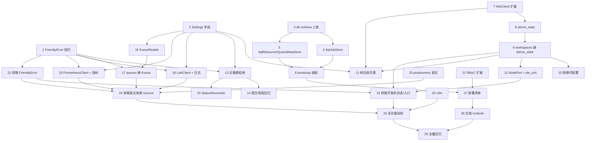

# Implementation Plan

## Overview

本计划把 `complete-training-platform` 设计拆为 29 个增量任务，按依赖分 7 个阶段（A 横切基础 →
B 持久化 → C 开发机生命周期 → D 真实提交 → E 集群数据接入 → F 前端 → G 部署文档）。除标注
「文档/部署」外，每个任务以 pytest（fake 注入、无需真实集群）收口，且不破坏现有绿测。访问入口
本期采用 NodePort（不引入 Ingress）。

## Tasks

> 说明：每个任务都是可独立执行、以测试收口的增量。任务尽量小步、可回滚。

## 阶段 A · 横切基础（错误契约 + 设置）

- [x] 1. FriendlyError 统一错误契约
  - 新增 `core/errors.py`：`FriendlyError(status, code, message, hint="")`
  - 在 `main.py` 注册全局 exception handler，序列化为 `{"error":{code,message,hint}}`
  - 补测试：抛 FriendlyError → 响应结构与状态码正确
  - _Requirements: 14.7_

- [x] 2. 新增 Settings 字段 + configmap 占位
  - settings.py 增加：`loki_url`、`prometheus_url`、`workspace_start_wait_s=60`、
    `allow_record_only_submit=false`、`status_reconcile_interval_s=30`、`workspace_node_host`
  - configmap.yaml 增加对应键（带注释，默认空/安全值）
  - _Requirements: 5.4, 8.1, 10.1, 4.3, 13.5_

## 阶段 B · 持久化（jobs / resources / queue_meta）

- [x] 3. db schema 增三表 + 幂等建表
  - `db.py.init_schema` 增加 `jobs` / `resources` / `queue_meta` 表（sqlite + postgres 兼容，
    AUTOINCREMENT/SERIAL 处理沿用既有逻辑）
  - 补测试：init_schema 后三表存在，重复调用幂等
  - _Requirements: 11.3_

- [x] 4. SqlJobStore（与内存 JobStore 接口一致）
  - `sql_store.py` 新增 `SqlJobStore`，实现 create/get/update/delete/list_visible/
    count_running_gpus，JSON 字段（env/resources/mounts/failure）序列化
  - 补测试：写入→重建 store→读回一致；内存与 SQL 对相同操作序列结果一致
  - _Requirements: 11.1, 11.2, 11.4_

- [x] 5. SqlResourceStore + SqlQueueMetaStore
  - `sql_store.py` 新增二者，接口与内存实现一致；queue_meta 仅存展示别名/排序
  - 补测试：CRUD + 重启可恢复
  - _Requirements: 11.1, 11.2, 11.4, 11.6_

- [x] 6. bootstrap 装配 + seed_demo 在持久化下默认关
  - `bootstrap.configure_persistence` 增 `set_job_store/set_resource_store/set_queue_meta_store`
  - 持久化模式下不写 seed 演示数据（与 14.6 一致）
  - 补测试：配 database_url 时三 store 为 SQL 实现；空时为内存实现
  - _Requirements: 11.1, 11.5, 14.6_

## 阶段 C · 开发机真实生命周期

- [x] 7. K8sClient 能力扩展
  - 新增 `pod_container_status(name,ns)->(kind,reason)`、`wait_pod_deleted(name,ns,timeout)`、
    `service_node_ports(name,ns)->dict`、`node_address(pod_name,ns)->str|None`
  - 补测试：用 fake kubernetes client 覆盖各分支（含 NotFound/waiting/terminated）
  - _Requirements: 1.2, 1.5, 3.2, 4.3_

- [x] 8. WorkspaceService.derive_state 状态映射
  - 新增 `core/workspace_service.py`，实现 `derive_state(rec)->(state,pod_phase,reason)`
    覆盖 NotFound/Pending/Running/ImagePullBackOff/CrashLoop/Failed/stopping 全分支
  - 补测试（覆盖 Property 1 全分支）
  - _Requirements: 1.1, 1.2, 1.3, 1.4, 1.5, 1.6_

- [x] 9. workspaces API 接入 derive_state（不再假 running）
  - `api/workspaces.py`：create 置 `creating`（不再直接 running）；list/get 用 derive_state
    填 `state`/`pod_phase`/`reason`
  - DevSession 同步复用 derive_state
  - 补测试：create 后 state=creating；pod Pending→starting；ImagePull→error+reason
  - _Requirements: 1.1, 1.3, 1.4, 1.5, 1.7_

- [x] 10. 镜像可配置 + 校验
  - create 支持 body.image，缺省用 settings.workspace_image；自定义镜像格式校验失败→400 Friendly
  - 补测试：自定义镜像生效；非法镜像 400
  - _Requirements: 2.1, 2.2, 2.4_

- [x] 11. 停后启可靠（Terminating/409）
  - WorkspaceService.start：先 wait_pod_deleted(timeout=workspace_start_wait_s)，超时→409 Friendly；
    create_pod 409→Friendly；成功→state=creating
  - stop/start 写审计日志
  - 补测试（覆盖 Property：停→启时序、超时、409）
  - _Requirements: 4.1, 4.2, 4.3, 4.4, 4.5, 4.6, 4.7_

- [x] 12. Workspace/DevSession Service 改 NodePort + ide_urls 重写
  - `core/workspace.py`/`devsession.py`：Service type→NodePort；`build_ide_urls` 改 NodePort 版
    （入参 node_host + port_map，仅 running 填值）
  - api 用 service_node_ports + node_address 拼 URL；未就绪/无 node_host→空+reason
  - 补测试：running 出 URL；非 running 空+reason
  - _Requirements: 3.2, 3.3, 3.5, 3.6_

## 阶段 D · 真实提交收敛（0→1）

- [x] 13. SubmissionService：无集群拒绝 + record-only 开关
  - `create_job` 提交前：gpu_type 无集群且 `allow_record_only_submit=false`→400 Friendly；
    不再产生永远 Queued 占位记录
  - 补测试：无集群默认拒绝；开关开启时允许 record-only
  - _Requirements: 5.1, 5.2, 5.4_

- [x] 14. 提交链路保真回归（code_uri / dataset env）
  - 用 FakeRay 断言 runtime_env.working_dir==code_uri、env 含 RAYTRAIN_DATA_SOURCE_URI
  - 取消 Live_Job 调 ray.stop（已存在，补回归）
  - 补测试（覆盖 Property 4）
  - _Requirements: 5.3, 5.6, 6.2, 6.3, 6.4, 7.1, 7.2, 7.3_

- [x] 15. StatusReconciler 后台协调
  - 新增 `core/status_reconciler.py`（仿 ReclaimLoop）；lifespan 启停；周期 reconcile 非终态
    Live_Job；终态不再轮询
  - 补测试（覆盖 Property 7）
  - _Requirements: 5.7_

## 阶段 E · 集群数据接入（Kueue / Loki / Prometheus）

- [x] 16. KueueReader（读真实队列）
  - 新增 `core/kueue_reader.py`：`K8sKueueReader`（CustomObjectsApi 读 ClusterQueue/LocalQueue，
    解析 nominal/used/admitted/pending + cluster_queue 关联 + gpu_type 推导）、`FakeKueueReader`
  - 读失败→KueueUnavailable
  - 补测试：用样例 CR JSON 断言解析与映射
  - _Requirements: 9.1, 9.2, 9.3, 9.7_

- [x] 17. /v1/console/queues 接 KueueReader（去硬编码）
  - 队列列表来自 KueueReader（不再读 _DEFAULT_QUEUES）；recentJobs 由 JobStore 补充；
    读失败→Friendly（不回退硬编码）
  - submit 时校验 queue 为该 gpu_type 真实存在的 LocalQueue（9.6）
  - 补测试：队列=fake Kueue 集合；读失败 Friendly；非法队列拒绝
  - _Requirements: 9.4, 9.5, 9.6_

- [x] 18. LokiClient + Job 日志改造
  - 新增 `core/loki_client.py`：`HttpLokiClient`（query_range 按 submission_id label、时间范围、
    容器过滤、分页 cursor）、`FakeLokiClient`
  - `/v1/console/jobs/{id}/logs`：live 且配 loki→查 Loki（结束后仍可查）；标注 source；
    失败→Friendly；未配/非 live→显式标注（不伪装）
  - 补测试（覆盖 Property 2 日志分支）
  - _Requirements: 8.1, 8.2, 8.3, 8.4, 8.5, 8.6_

- [x] 19. PrometheusClient + Metrics 改造
  - 新增 `core/prometheus_client.py`：`HttpPrometheusClient`（query_range 按 pod label，GPU 利用率/
    显存/吞吐 PromQL 模板）、`FakePrometheusClient`
  - Job Detail metrics：live 且配 prom→查真实并标 source；无数据→空序列+标注；失败→Friendly
  - 补测试（覆盖 Property 2 指标分支）
  - _Requirements: 10.1, 10.2, 10.3, 10.4, 10.6_

- [x] 20. Job Detail pods/events 接真实 K8s
  - live job 的 pods 按 `ray.io/job-submission-id` label 真实 list；events 真实读取并翻译 reason；
    非 live 显式标注不可用（不合成）
  - 补测试：fake K8s 返回 pod/event → 映射正确
  - _Requirements: 14.5_

- [x] 21. RBAC 扩展（serviceaccount.yaml）
  - 增 kueue.x-k8s.io clusterqueues/localqueues get/list/watch；services/nodes/events get/list
  - _Requirements: 9.1, 3.2_（文档/部署，无单测）

## 阶段 F · 前端（去合成数据 + i18n + 友好错误）

- [x] 22. FriendlyError 前端契约 + errMsg 升级
  - `api/client`：解析 `{error:{code,message,hint}}`；errMsg 读 code 映射文案，回退 message
  - 所有 mutation：进行中态（禁用/spinner）、失败 toast Friendly
  - _Requirements: 14.1, 14.2, 14.3, 14.7_

- [x] 23. 开发机页接真实状态/入口
  - 展示后端 state/pod_phase/reason；非 running 禁用 IDE/SSH 入口并提示；展示 NodePort URL；
    停/启失败显示 Friendly
  - 移除前端任何"直接显示 running"的逻辑
  - _Requirements: 1.7, 3.4, 3.5, 3.6, 14.4_

- [x] 24. 队列/日志/指标页接真实来源 + source 标注
  - Queues 仅展示后端真实队列；Create Job 队列候选来自真实 Kueue；无队列阻止提交
  - Job Detail 日志/指标展示真实数据并标 source=loki/prometheus；不可用时显式提示
  - 移除 mockData 充当展示的路径；空数据走空状态（非 seed）
  - _Requirements: 8.6, 9.5, 9.6, 10.5, 14.5, 14.6_

- [x] 25. i18n（中英切换）
  - 引入 react-i18next；`src/i18n/{zh,en}.json`；LanguageProvider + 顶栏切换；localStorage 持久化
  - 全站文案抽 key；缺失回退 zh；日期/数字按 locale；FriendlyError 按 code 本地化
  - _Requirements: 12.1, 12.2, 12.3, 12.4, 12.5, 12.6_

- [x] 26. 全功能可用巡检（去死按钮/假状态）
  - 逐页核对：每个可见控件触发真实调用或受支持行为；依赖未配置→禁用+提示；列表空→空状态
  - _Requirements: 14.1, 14.4, 14.5, 14.6_

## 阶段 G · 部署与文档

- [x] 27. 部署清单更新（NodePort + RBAC + settings + 持久化）
  - workspace/devsession Service NodePort；serviceaccount RBAC；configmap 新键；
    生产 database_url=postgres、seed_demo=false
  - _Requirements: 11.1, 13.5_（部署）

- [x] 28. 文档：0→1 runbook + NodePort 访问 + HTTPS 风险与演进
  - 更新 `docs/platform-deploy.md`、`docs/platform-live-training.md`：端到端 0→1 验收清单、
    NodePort 访问 IDE/SSH 说明、JWT-over-HTTP 风险标注、Ingress+TLS 演进步骤与回退排查
  - _Requirements: 7.4, 13.4, 13.6_

- [x] 29. 全量回归 + 交付校验
  - 跑通 server 全量 pytest + console build；核对需求可追溯表逐条有测试或文档覆盖
  - _Requirements: 全部（验收）_

## Task Dependency Graph



并行提示：阶段 A（1、2）可先做；之后 B（3→4/5→6）、C（7→8→9→…）、E 的 16/18/19 三个 client
彼此独立，可并行推进；前端 F 依赖对应后端任务完成；G 收尾。

波次定义（wave-based 并行调度，同一波内任务可并行）：

```json
{
  "waves": [
    { "wave": 1, "tasks": [1, 2, 3, 7, 16] },
    { "wave": 2, "tasks": [4, 5, 8, 18, 19] },
    { "wave": 3, "tasks": [6, 9, 13, 20, 21] },
    { "wave": 4, "tasks": [10, 11, 12, 14, 15, 17] },
    { "wave": 5, "tasks": [22] },
    { "wave": 6, "tasks": [23, 24, 25] },
    { "wave": 7, "tasks": [26, 27] },
    { "wave": 8, "tasks": [28] },
    { "wave": 9, "tasks": [29] }
  ]
}
```

## Notes

- **测试约定**：所有后端任务用现有 fake 注入模式（FakeRay / FakeK8s / FakeKueueReader /
  FakeLokiClient / FakePrometheusClient）+ sqlite 临时库，CI 无需真实集群。
- **不破坏既有**：保持现有 store / API 签名；新增能力以新方法/新模块加入；改动后跑全量
  pytest 确认无回归。
- **正确性属性**：Property 1–8（见 design.md）分别由任务 8/9（P1）、18/19（P2）、13（P3）、
  14（P4）、4/5（P5）、16/17（P6）、15（P7）、25（P8）覆盖。
- **访问入口**：本期 NodePort；Ingress+HTTPS 为后续演进，任务 28 文档化切换步骤。
- **真集群验收**：任务 28 的 0→1 runbook 需在你的集群（配 shared_clusters + Kueue + Loki +
  Prometheus + postgres）上人工执行一遍，作为最终交付验收。
