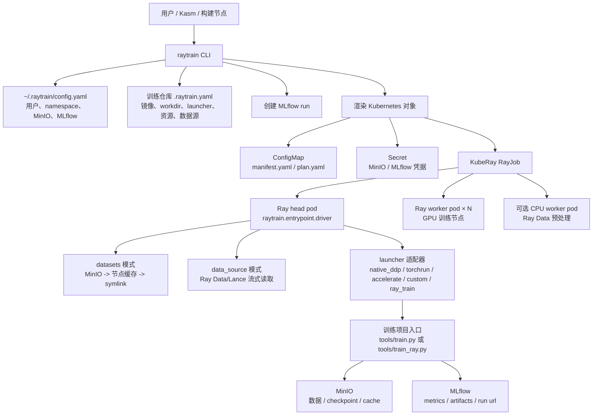
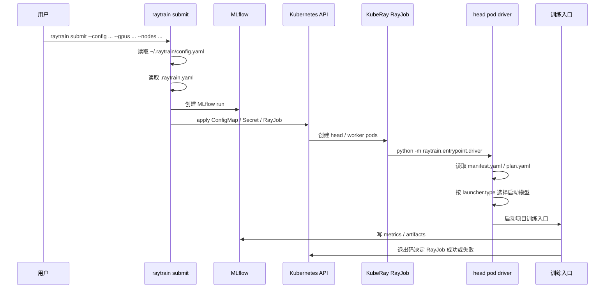
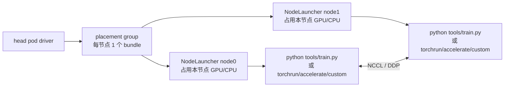
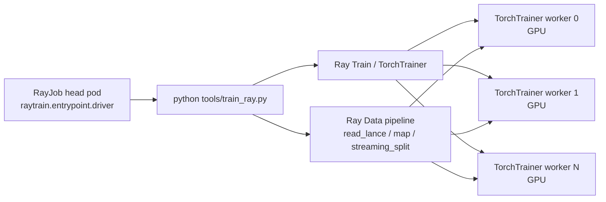
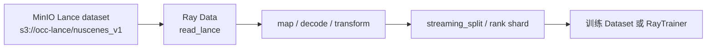

# raytrain

> **📖 找文档？先看 [`docs/README.md`](docs/README.md) —— 文档总导航，按「我想做什么」对号入座。**
>
> 本仓库有两层：**平台**（浏览器：`raytrain-server` + `raytrain-console`，当前主线）和
> **CLI**（命令行 `raytrain submit`，同源旁路）。
> - 部署平台 → [`docs/platform-deploy.md`](docs/platform-deploy.md)
> - 单节点快速验证 → [`deploy/local-singlenode/README.md`](deploy/local-singlenode/README.md)
> - 本 README 以下内容主要讲 **CLI**。

`raytrain` 是一个把训练项目提交到 KubeRay 的轻量框架。它的目标不是替代训练框架，而是把 **镜像、资源、RayJob、分布式启动、数据源、MLflow、日志和调试入口** 统一起来，让建模同学用一条命令提交训练任务。

最常用命令：

```bash
cd <training-repo>

raytrain submit \
  --config configs/xxx.py \
  --gpus 1 \
  --nodes 1 \
  --gpu-type h20 \
  --name smoke
```

每个训练项目只需要在仓库根目录维护一份 `.raytrain.yaml`，描述这个项目如何启动、用什么镜像、要多少默认资源、数据从哪里来。日常提交时不写 Kubernetes YAML，不手写 RayJob。

## 1. 解决什么问题

没有 `raytrain` 时，一个新训练项目要上 K8s/KubeRay，通常要同时处理：

- 写 RayJob YAML。
- 写 head/worker group 资源。
- 管理镜像 tag。
- 注入 MinIO、MLflow、NCCL、Ray 相关环境变量。
- 多节点时计算 master addr、rank、world size。
- 同步数据集或接 Ray Data/Lance。
- 查日志、进 Pod、停任务。
- 把训练产物和 MLflow run 关联起来。

`raytrain` 把这些通用部分收敛成：

```text
训练项目代码 + Dockerfile + .raytrain.yaml
        |
        v
raytrain submit --config ... --gpus ... --nodes ...
        |
        v
RayJob + ConfigMap + Secret + MLflow run + logs/exec/status
```

训练代码只需要满足一个条件：**能用某种明确的启动方式跑起来**。这个启动方式由 `.raytrain.yaml` 的 `launcher.type` 描述。

## 2. 什么时候用 raytrain

适合：

- PyTorch DDP / Pointcept / MM 系训练。
- 标准 `torchrun` 训练。
- HuggingFace Accelerate 训练。
- 训练入口内部使用 Ray Train / TorchTrainer 的项目。
- 数据在 MinIO，本地缓存或 Ray Data/Lance 流式读取。
- 需要 MLflow 记录 run、日志、artifact。

不适合：

- 训练代码完全不能容器化。
- 必须手动登录节点启动的实验。
- 对 Kubernetes/Ray 完全绕开、不需要统一提交的任务。

## 3. 角色分工

| 角色 | 负责内容 |
|---|---|
| 建模同学 | 修改训练代码、写 config、提交 `raytrain submit`、看日志 |
| 项目接入人 | 写 Dockerfile、写 `.raytrain.yaml`、确认 launcher 和数据源 |
| 平台/运维 | 维护 base 镜像、KubeRay、RBAC、MinIO、MLflow、GPU 节点 |
| raytrain | 渲染 RayJob、注入环境变量、启动训练、管理日志/状态/MLflow |

## 4. 总体架构



## 5. 提交流程



## 6. 运行时模型

### 6.1 `native_ddp` / `torchrun` / `accelerate` / `custom`

这几类 launcher 的共同点是：`raytrain` 在每个 GPU 节点创建一个 `NodeLauncher` actor，然后在 actor 里启动一个项目训练子进程。



适合：

- 项目入口自己会启动本节点多卡进程，例如 Pointcept `tools/train.py --num-gpus ...`。
- 标准 `torchrun`。
- 标准 `accelerate launch`。
- 特殊但仍然是“每个节点一个训练命令”的项目。

### 6.2 `ray_train`

`ray_train` 是给内部使用 Ray Train / TorchTrainer 的训练入口准备的。它不会创建 GPU `NodeLauncher` actor，而是在 RayJob head 里只启动一次 driver，让训练入口自己向 Ray 集群申请 worker。



适合：

- `tools/train_ray.py` 内部创建 `TorchTrainer`。
- 训练入口内部已经管理 Ray Data 分片。
- 不能让外层 `NodeLauncher` 先占住 GPU。

典型项目：`sslod26` Sonata SSL 预训练。

## 7. launcher 怎么选

| launcher | 训练代码形态 | raytrain 行为 | 常见项目 |
|---|---|---|---|
| `native_ddp` | 项目入口自己支持多机多卡参数，例如 `--num-gpus`、`--num-machines`、`--machine-rank`、`--dist-url` | 每个节点启动一个项目进程，项目内部再 spawn/DDP | Pointcept |
| `torchrun` | 标准 PyTorch DDP 脚本 | 每节点拼出 `torchrun` 命令 | 普通 PyTorch |
| `accelerate` | HuggingFace Accelerate 项目 | 每节点拼出 `accelerate launch` | Transformers |
| `custom` | 特殊命令，但仍是每节点一个 subprocess | entrypoint 原样 split 后执行 | 兼容项目 |
| `ray_train` | 入口内部使用 Ray Train / TorchTrainer | head 中只启动一次 entrypoint，GPU worker 由入口自己申请 | sslod26 SSL |

判断方法：

```text
问题 1：你的训练入口是否内部创建 TorchTrainer / Ray Train worker？
  是 -> ray_train
  否 -> 看问题 2

问题 2：你的训练入口是否自己支持 --num-gpus/--num-machines/--machine-rank？
  是 -> native_ddp
  否 -> 看问题 3

问题 3：你的项目能用 torchrun 启动吗？
  是 -> torchrun
  否 -> 看问题 4

问题 4：你的项目能用 accelerate launch 启动吗？
  是 -> accelerate
  否 -> custom，但要确认它仍然符合每节点一个命令的资源模型
```

不要用 `custom` 包 `tools/train_ray.py` 这种 Ray Train 入口。外层 actor 会先占 GPU，内层 TorchTrainer 再申请 GPU，容易 pending。

## 8. 数据模式

`raytrain` 支持两种数据模式，二选一。

### 8.1 `datasets:` 本地缓存模式

适合中小数据集或已有本地路径假设的项目。

```yaml
datasets:
  - {name: scannet, s3: s3://pointcept-data/scannet, mount: data/scannet}
```

运行时：


特点：

- 首次任务会同步数据到节点缓存。
- 后续任务命中 `.done` 标记后跳过下载。
- 训练代码几乎不用改。
- 数据很大时不适合，启动等待时间长，本地盘压力大。

### 8.2 `data_source:` Ray Data/Lance 流式模式

适合大数据集、Lance/Parquet、希望流式读取和分布式预处理的项目。

```yaml
data_source:
  type: lance
  uri: s3://occ-lance/nuscenes_v1
  version: latest
  # filter: "split == 'train'"
  # columns: [coord, strength, segment]

cpu_workers: 0
```

运行时：



特点：

- 不做本地数据集同步。
- `data_source:` 会注入到环境变量和 ConfigMap。
- 训练代码需要能消费 Ray Data/Lance。
- `datasets:` 和 `data_source:` 不能同时使用。

注入的常用环境变量：

| 环境变量 | 说明 |
|---|---|
| `RAYTRAIN_DATA_SOURCE_TYPE` | `lance` 或其他类型 |
| `RAYTRAIN_DATA_SOURCE_URI` | 数据源 URI |
| `RAYTRAIN_DATA_SOURCE_VERSION` | Lance version |
| `RAYTRAIN_DATA_SOURCE_FILTER` | 可选过滤表达式 |
| `RAYTRAIN_DATA_SOURCE_COLUMNS` | 可选列裁剪 |
| `RAYTRAIN_RUN_ID` | MLflow run id |
| `MLFLOW_TRACKING_URI` | MLflow 地址 |
| `AWS_ACCESS_KEY_ID` / `AWS_SECRET_ACCESS_KEY` | MinIO/S3 凭据 |
| `MINIO_ACCESS_KEY` / `MINIO_SECRET_KEY` | MinIO 凭据别名 |

## 9. `.raytrain.yaml` 最小模板

### 9.1 `native_ddp` 模板

```yaml
apiVersion: raytrain/v1

image: 172.31.9.104:5050/training/my-project:latest
workdir: /workspace/my-project
repo_name: my-project
save_path: s3://my-bucket/exp/{user}/{run_id}

launcher:
  type: native_ddp
  entrypoint: tools/train.py
  env:
    PYTHONPATH: /workspace/my-project:/opt/conda/lib/python3.11/site-packages
    WANDB_MODE: "disabled"
  args:
    - --config-file={config}
    - --num-gpus={num_gpus_per_node}
    - --num-machines={num_nodes}
    - --machine-rank={node_rank}
    - --dist-url=tcp://{master_addr}:{master_port}
    - --options
    - save_path={save_path}

resources:
  gpus_per_node: 8
  cpus_per_node: 32
  memory_per_node: 256Gi
  shm_size: 128Gi
  object_store_memory: 64Gi

data_source:
  type: lance
  uri: s3://my-lance-datasets/train
  version: latest

cpu_workers: 0
artifacts: []
```

### 9.2 `torchrun` 模板

```yaml
apiVersion: raytrain/v1

image: 172.31.9.104:5050/training/my-torchrun:latest
workdir: /workspace/my-project
repo_name: my-torchrun
save_path: s3://my-bucket/exp/{user}/{run_id}

launcher:
  type: torchrun
  entrypoint: train.py
  env:
    PYTHONPATH: /workspace/my-project
  args:
    - --config
    - "{config}"
    - --output
    - "{save_path}"

resources:
  gpus_per_node: 8
  cpus_per_node: 32
  memory_per_node: 256Gi
  shm_size: 128Gi
  object_store_memory: 64Gi
```

`torchrun` launcher 会由 raytrain 补齐 `--nnodes`、`--nproc_per_node`、`--node_rank`、`--master_addr`、`--master_port`。

### 9.3 `ray_train` 模板

```yaml
apiVersion: raytrain/v1

image: 172.31.9.104:5050/training/my-ray-train:latest
workdir: /workspace/my-project
repo_name: my-ray-train
save_path: s3://my-bucket/exp/{user}/{run_id}

launcher:
  type: ray_train
  entrypoint: tools/train_ray.py
  env:
    PYTHONPATH: /workspace/my-project:/opt/conda/lib/python3.11/site-packages
    NCCL_IB_DISABLE: "1"
    NCCL_SOCKET_IFNAME: eth0
    GLOO_SOCKET_IFNAME: eth0
  args:
    - --config
    - "{config}"
    - --num-workers
    - "{world_size}"
    - --cpus-per-worker
    - "{cpus_per_worker}"
    - --run-name
    - "{run_name}"
    - --storage-path
    - "{save_path}"

resources:
  gpus_per_node: 8
  cpus_per_node: 32
  memory_per_node: 256Gi
  shm_size: 128Gi
  object_store_memory: 64Gi

data_source:
  type: lance
  uri: s3://occ-lance/nuscenes_v1
  version: latest

cpu_workers: 0
artifacts: []
```

## 10. 占位符

`launcher.args` 和部分字段里可以使用占位符。它们在 submit 或 driver 阶段替换。

| 占位符 | 含义 |
|---|---|
| `{config}` | `raytrain submit --config` 传入的路径 |
| `{run_name}` | 本次任务名 |
| `{user}` | `~/.raytrain/config.yaml` 中的用户名 |
| `{run_id}` | MLflow run id |
| `{save_path}` | 解析后的保存路径 |
| `{num_nodes}` | 节点数 |
| `{num_gpus_per_node}` | 每节点 GPU 数 |
| `{world_size}` | `num_nodes * num_gpus_per_node` |
| `{node_rank}` | 当前节点 rank，`native_ddp/torchrun` 常用 |
| `{master_addr}` | rank 0 节点 IP |
| `{master_port}` | driver 选出的端口 |
| `{cpus_per_worker}` | `cpus_per_node / gpus_per_node`，`ray_train` 常用 |

## 11. CLI 命令

### 11.1 首次配置

```bash
raytrain configure
```

生成或更新：

```text
~/.raytrain/config.yaml
```

里面包含 namespace、MinIO endpoint、MinIO 凭据、MLflow 地址等。

### 11.2 提交任务

```bash
raytrain submit \
  --config configs/xxx.py \
  --gpus 1 \
  --nodes 1 \
  --gpu-type h20 \
  --name smoke
```

常用参数：

| 参数 | 作用 |
|---|---|
| `--config` | 训练 config，相对项目根目录 |
| `--name` | run/job 名称 |
| `--gpus` | 每节点 GPU 数 |
| `--nodes` | 节点数 |
| `--gpu-type` | GPU 池，当前常用 `h20` / `a100` |
| `--image` | 临时覆盖 `.raytrain.yaml` 中的镜像 |
| `--manifest-path` | 指定 `.raytrain.yaml` 路径 |
| `--experiment` | MLflow experiment |
| `--ttl` | RayJob 完成后的保留时间 |
| `--dry-run` | 只打印 YAML，不提交 |
| `--config-override` | 追加训练配置覆盖项 |
| `--save-path` | 临时覆盖保存路径 |

### 11.3 查看和调试

```bash
raytrain list
raytrain list --all-users

raytrain logs <job_name> -f
raytrain logs <job_name> --worker 0 -f

raytrain exec <job_name>
raytrain exec <job_name> --worker 0

raytrain mlflow <job_name>
raytrain mlflow <job_name> --open

raytrain stop <job_name>
```

### 11.4 数据工具

```bash
raytrain data ls s3://bucket/path
raytrain data push ./local-dir s3://bucket/path
raytrain data pull s3://bucket/path ./local-dir
```

## 12. 新训练项目接入标准流程

这是最重要的部分。新项目不要一上来就多机多卡，按下面顺序推进。

### 阶段 0：回答三个问题

1. 训练入口是什么？
   - `tools/train.py`
   - `train.py`
   - `tools/train_ray.py`

2. 分布式谁负责？
   - 项目自己 spawn/DDP -> `native_ddp`
   - `torchrun` -> `torchrun`
   - `accelerate` -> `accelerate`
   - TorchTrainer -> `ray_train`

3. 数据怎么读？
   - 本地路径/小数据集 -> `datasets:`
   - Lance/Parquet/大数据集 -> `data_source:`

### 阶段 1：先在容器内单机单卡跑通

在写 `.raytrain.yaml` 之前，先确认镜像里能手动跑训练入口：

```bash
docker run --rm --gpus all -it <image> bash
cd <workdir>
python tools/train.py --help
```

最低验收：

- `import torch, ray, raytrain` 成功。
- `import <your_project>` 成功。
- 训练入口能打印 help 或进入 config parse。
- `workdir` 和 `.raytrain.yaml` 计划中的路径一致。

### 阶段 2：写 Dockerfile

原则：

- base 镜像里放通用 Ray/PyTorch/raytrain。
- 项目镜像只放项目依赖和项目代码。
- `COPY .raytrain.yaml` 到镜像里，方便进 Pod 后排查。
- 如果 base 镜像已经保持最新 raytrain，不要在项目镜像里安装旧的 `raytrain` 副本。

最小结构：

```dockerfile
FROM 172.31.9.104:5050/training/base-raytrainv1.0.2-pytorch:ray2.54.1-torch2.5.0-cu124-raydata1.0

WORKDIR /workspace/my-project

RUN pip install <project-deps>

COPY configs /workspace/my-project/configs
COPY my_project /workspace/my-project/my_project
COPY tools /workspace/my-project/tools
COPY .raytrain.yaml /workspace/my-project/

RUN python -c "import torch, ray, raytrain; print(torch.__version__, ray.__version__)"

CMD ["bash"]
```

构建：

```bash
docker build -f Dockerfile -t 172.31.9.104:5050/training/my-project:raytrain-v1 .
docker push 172.31.9.104:5050/training/my-project:raytrain-v1
```

### 阶段 3：写 `.raytrain.yaml`

从模板开始，不要直接复制复杂项目。

先写最小：

- `image`
- `workdir`
- `repo_name`
- `save_path`
- `launcher`
- `resources`
- `datasets` 或 `data_source`

然后 dry-run。

### 阶段 4：dry-run

```bash
raytrain submit \
  --config configs/smoke.py \
  --gpus 1 \
  --nodes 1 \
  --gpu-type h20 \
  --name my-smoke \
  --dry-run
```

dry-run 必看：

- 镜像 tag 是否正确。
- `workdir` 是否正确。
- `launcher.type` 是否正确。
- entrypoint 是否正确。
- 参数是否替换正确。
- `data_source` 和 `datasets` 是否二选一。
- GPU/CPU/memory/shm/object store 是否合理。
- Secret/ConfigMap/RayJob 是否完整。

### 阶段 5：单卡 smoke

```bash
raytrain submit \
  --config configs/smoke.py \
  --gpus 1 \
  --nodes 1 \
  --gpu-type h20 \
  --name my-smoke
```

单卡验收：

- RayJob 成功创建。
- head/worker pod running。
- 训练入口被正确执行。
- 数据能读到。
- 进入第一个 step。
- MLflow run 有记录。
- `save_path` 能写入。

只要进入第一个 step，就可以停止 smoke：

```bash
raytrain stop <job_name>
```

### 阶段 6：单节点多卡

```bash
raytrain submit \
  --config configs/train.py \
  --gpus 8 \
  --nodes 1 \
  --gpu-type h20 \
  --name my-1node
```

重点看：

- rank/world size 是否正确。
- 每张 GPU 是否有进程。
- DDP/NCCL 是否正常。
- 数据分片是否重复或为空。

### 阶段 7：多节点

```bash
raytrain submit \
  --config configs/train.py \
  --gpus 8 \
  --nodes 2 \
  --gpu-type h20 \
  --name my-2node
```

重点看：

- master addr 是否可达。
- 每个节点 rank 是否正确。
- NCCL 跨节点是否正常。
- checkpoint 是否只有预期 rank 写。
- 训练吞吐是否稳定。

## 13. 新项目接入检查清单

代码：

- [ ] 训练入口能在容器里单机单卡跑。
- [ ] 项目 import 路径正确。
- [ ] config 路径相对仓库根目录可用。
- [ ] 训练保存路径能被参数覆盖。
- [ ] 多卡时不会重复初始化冲突。

镜像：

- [ ] Dockerfile 使用正确 base 镜像。
- [ ] 项目代码 COPY 到 `.raytrain.yaml workdir`。
- [ ] `PYTHONPATH` 覆盖到项目根。
- [ ] 镜像内 `import raytrain` 成功。
- [ ] 如果需要 `ray_train`，镜像内 `LAUNCHERS` 包含 `ray_train`。

`.raytrain.yaml`：

- [ ] `image` 是已 push 的 tag。
- [ ] `workdir` 与 Dockerfile 一致。
- [ ] `launcher.type` 与训练入口匹配。
- [ ] `launcher.args` 能表达原训练命令。
- [ ] `datasets` 和 `data_source` 没有同时出现。
- [ ] `save_path` 使用 `{user}/{run_id}` 避免覆盖。
- [ ] `resources` 合理。

提交：

- [ ] `--dry-run` 正常。
- [ ] 单卡 smoke 进入第一个 step。
- [ ] 单节点多卡正常。
- [ ] 多节点正常。
- [ ] MLflow 和 checkpoint 可查。

## 14. 当前已验证项目模式

### 14.1 Pointcept 监督语义分割

路径：

```text
/Users/ashersu/Desktop/go-project/pointcept-main
```

模式：

```text
launcher.type = native_ddp
entrypoint = tools/train.py
data_source = s3://occ-lance/nuscenes_v1
```

命令：

```bash
cd /Users/ashersu/Desktop/go-project/pointcept-main

raytrain submit \
  --config configs/nuscenes/semseg-pt-v3m1-0-lance.py \
  --gpus 1 --nodes 1 --gpu-type h20 --name point-lance-smoke
```

详细手册：

- [Pointcept 与 sslod26 使用 raytrain 提交训练完整手册](docs/pointcept-sslod26-raytrain-runbook.md)

### 14.2 sslod26 Sonata SSL 预训练

路径：

```text
/Users/ashersu/Desktop/go-project/sslod26-master
```

模式：

```text
launcher.type = ray_train
entrypoint = tools/train_ray.py
data_source = s3://occ-lance/nuscenes_v1
```

命令：

```bash
cd /Users/ashersu/Desktop/go-project/sslod26-master

raytrain submit \
  --config configs/sonata/pretrain-sonata-occ-lance-demo.py \
  --gpus 1 --nodes 1 --gpu-type h20 --name sslod-ssl-smoke
```

改造说明：

- [sslod26-master 到 sslod26-main：Ray Data/Lance 训练改造说明](docs/sslod26-raydata-raytrain-before-after.md)

## 15. 目录结构

```text
raytrain/
├── raytrain/                  # CLI（命令行提交工具）
│   ├── cli/                   # submit / logs / status / data / exec / configure
│   ├── entrypoint/            # RayJob head pod 内的 driver + launchers
│   ├── data/                  # data_source 环境变量 + Ray Data/Lance
│   ├── templates/             # rayjob.yaml.j2
│   ├── manifest.py            # .raytrain.yaml 解析和校验
│   ├── rayjob.py              # 渲染 ConfigMap / Secret / RayJob
│   ├── code_sync.py           # 打包代码上传 MinIO（code-as-submission）
│   └── platform_client.py     # 调 raytrain-server 的客户端
├── raytrain-server/           # 平台后端（FastAPI 控制面）
│   ├── raytrain_server/
│   │   ├── api/               # auth / console / workspaces / devsessions / jobs / datasets / admin_*
│   │   ├── core/              # jwt_auth / quota / users / sql_store / k8s_client / kueue_reader /
│   │   │                      #   loki_client / prometheus_client / artifact_store / submission_service
│   │   └── training/          # 提交编排
│   └── deploy/                # 生产部署清单（kustomization：ns/sa/secret/pg/cm/svc/deploy/raycluster）
├── raytrain-console/          # 平台前端（React + TypeScript + Tailwind 工作台，真实数据 + 中/EN i18n）
│   ├── src/                   # pages / components / lib (真实 API 客户端) / i18n
│   └── deploy/                # 前端部署清单（web.yaml）
├── deploy/                    # 集群基础设施脚本 + 共享集群清单
│   ├── local-singlenode/      # 单节点快速验证包
│   ├── shared-cluster/        # 长寿 RayCluster 清单
│   ├── rbac/                  # per_job 时代的 RBAC 工具（遗留）
│   └── server/                # server 镜像 + deployment（旧）
├── docs/                      # 文档（入口见 docs/README.md）
├── examples/                  # 示例 .raytrain.yaml
├── tests/                     # CLI 测试
├── pyproject.toml
└── Makefile
```

## 16. 关键内部逻辑

### 16.1 submit 侧

`raytrain submit` 做四件事：

1. 读取用户配置：`~/.raytrain/config.yaml`。
2. 读取项目配置：`.raytrain.yaml`。
3. 创建 MLflow run，生成 `run_id` 和 `save_path`。
4. 渲染并提交：
   - ConfigMap：`manifest.yaml`、`plan.yaml`
   - Secret：MinIO/MLflow 凭据
   - RayJob：head/worker/cpu-worker pod spec

### 16.2 RayJob driver 侧

RayJob head pod 启动：

```bash
python -m raytrain.entrypoint.driver --manifest /raytrain/manifest.yaml --plan /raytrain/plan.yaml
```

driver 做：

1. `ray.init(address="auto")` 连接当前 Ray 集群。
2. 读取 `launcher.type`。
3. 如果是 `ray_train`：
   - 在 head 中启动一次 entrypoint。
   - 不创建 GPU `NodeLauncher`。
4. 如果是其他 launcher：
   - 创建 placement group。
   - 每个节点启动一个 `NodeLauncher` actor。
   - 每个 actor 执行数据同步或跳过同步。
   - 每个 actor 拼接并执行训练命令。
5. 收集退出码，更新 MLflow 状态。

### 16.3 data_source 注入

`data_source` 同时进入：

- ConfigMap 的 `plan.yaml`。
- Ray pod 环境变量。
- driver 子进程环境变量。
- Ray Train worker 可继承的环境变量。

这样项目代码既可以从 `manifest/plan` 读，也可以直接从环境变量读。

## 17. 常见故障

| 现象 | 原因 | 处理 |
|---|---|---|
| `unsupported launcher.type` | `.raytrain.yaml` 写了当前 raytrain 不支持的 launcher | 检查 `raytrain/manifest.py` 和镜像里的 raytrain 版本 |
| 提交端支持 `ray_train`，Pod 里不支持 | 项目镜像安装了旧 raytrain 副本 | 删除旧副本安装，或同步后重建镜像 |
| Ray Train 任务 pending | 用 `native_ddp/custom` 跑了 `tools/train_ray.py` | 改成 `launcher.type: ray_train` |
| `Dataset at path .../_versions not found` | Lance URI 不是 dataset 根目录 | 改成包含 `_versions` 的 URI |
| `No module named pointcept` | `workdir/PYTHONPATH` 不一致 | 对齐 Dockerfile COPY 路径和 `.raytrain.yaml` |
| loss 一直 0 | 标签缺失或全 ignore | 检查 label schema、`segment`、`lidar_semseg_path` |
| NCCL 失败 | 网卡/IB/跨节点通信问题 | 设置 `NCCL_IB_DISABLE=1`、`NCCL_SOCKET_IFNAME=eth0`、`GLOO_SOCKET_IFNAME=eth0` |
| 任务 Pending | GPU 资源不足或镜像拉取失败 | `raytrain list`、`raytrain logs`、`kubectl describe pod` |
| 训练产物找不到 | `save_path` 没覆盖成功 | dry-run 看最终 args，检查 `{save_path}` |

## 18. 文档入口

> 完整文档导航见 **[`docs/README.md`](docs/README.md)**（按「我想做什么」分类）。下面是 CLI 相关的常用几篇：

| 文档 | 说明 |
|---|---|
| [docs/README.md](docs/README.md) | **文档总导航（先看这个）** |
| [quickstart.md](docs/quickstart.md) | 首次安装、配置、跑通第一个任务 |
| [user-guide.md](docs/user-guide.md) | 日常提交、日志、exec、数据模式 |
| [adding-new-repo.md](docs/adding-new-repo.md) | 新训练项目接入指南 |
| [ops-guide.md](docs/ops-guide.md) | 运维、镜像、RBAC、故障排查 |
| [platform-deploy.md](docs/platform-deploy.md) | 平台部署（浏览器训练平台） |
| [pointcept-sslod26-raytrain-runbook.md](docs/pointcept-sslod26-raytrain-runbook.md) | Pointcept 和 sslod26 完整操作手册 |
| [sslod26-raydata-raytrain-before-after.md](docs/sslod26-raydata-raytrain-before-after.md) | sslod26 从 master 改造成 Ray Data/Lance 的说明 |

## 19. 最短接入路线

如果只记一套流程，记这个：

```text
1. 先确认训练入口在容器内单卡能跑
2. 选择 launcher
3. 写 Dockerfile，把代码 COPY 到 workdir
4. 写 .raytrain.yaml
5. raytrain submit --dry-run
6. 单卡 smoke
7. 单节点多卡
8. 多节点
9. 看 MLflow 和 save_path
```

新项目接入困难时，不要先调 K8s。先把问题拆成三层：

```text
镜像层：代码和依赖是否在容器里可 import？
启动层：launcher 是否匹配原训练命令？
数据层：datasets 或 data_source 是否能读到？
```

只要这三层分别通过，`raytrain submit` 就只是把它们组合成 RayJob。

